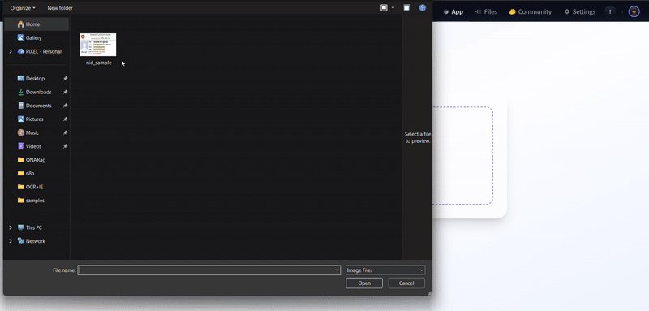

# 📄 Bangla-English Document Intelligence Pipeline

[](https://huggingface.co/spaces/mrshibly/LlamaOCR-Pipeline)
[](https://www.docker.com/)
[](https://fastapi.tiangolo.com/)
[](https://groq.com/)

A production-ready **Document AI** solution designed to automate the extraction of structured data from bilingual (Bangla/English) identity documents. This project demonstrates a hybrid approach combining **Deep Learning OCR** with **Large Language Models (LLMs)** for semantic parsing.

---

## 🚀 Live Demo & Preview

**🔗 Try the App:** [**LlamaOCR-Pipeline on Hugging Face Spaces**](https://huggingface.co/spaces/mrshibly/LlamaOCR-Pipeline)

### System in Action


---

## 🎯 Problem Statement
Extracting structured information from non-standardized/noisy documents (like National IDs in mixed languages) is a classic computer vision challenge. Traditional rule-based regex fails on unstructured layouts, while pure OCR lacks semantic understanding.

**Solution:** A robust pipeline that layers:
1.  **Computer Vision:** For image cleanup and preprocessing.
2.  **Deep Learning OCR (EasyOCR/PyTorch):** For accurate character recognition in low-resource languages (Bengali).
3.  **Generative AI (Llama 3):** For context-aware information extraction and JSON structuring.

---

## 🏗️ System Architecture

The system is architected as a microservice using **FastAPI**, containerized with **Docker** for consistent deployment.


---

## 🛠️ Technical Stack

### Core AI/ML Components
*   **OCR Engine:** **EasyOCR** (based on PyTorch) – Chosen for its superior performance on Bengali scripts compared to Tesseract.
*   **LLM Inference:** **Llama 3.3 70B** via **Groq API** – Selected for near-instant inference capabilities, ensuring low latency for the end-user.
*   **Preprocessing:** **OpenCV** & **NumPy** – Adaptive thresholding and noise reduction.

### Backend & DevOps
*   **Framework:** **FastAPI** (Python 3.10) – Asynchronous request handling.
*   **Containerization:** **Docker** – Multi-stage build optimized for CPU-only environments (Hugging Face Spaces).
*   **CI/CD:** Automated deployment triggers via Hugging Face.

---

## 📦 Installation & Local Development

### Prerequisites
*   Python 3.10+
*   Groq API Key (for LLM inference)

### 1. Clone & Setup
```bash
git clone https://github.com/mrshibly/LlamaOCR-Pipeline.git
cd LlamaOCR-Pipeline

# Install dependencies
pip install -r requirements.txt
```

### 2. Configuration
Create a `.env` file or export your API key:
```bash
export GROQ_API_KEY="your_actual_key_here"
```

### 3. Run the Service
```bash
python app.py
```
*The UI will be accessible at `http://localhost:7860`*

---

## 🐳 Docker Deployment

This project includes a production-optimized `Dockerfile`.

```bash
# Build the image
docker build -t llamaocr-pipeline .

# Run container (mapping port 7860)
docker run -p 7860:7860 -e GROQ_API_KEY="your_key" llamaocr-pipeline
```

---

## 📂 Repository Structure

```text
├── app.py                 # Application entry point & pipeline logic
├── Dockerfile             # Container configuration for HF Spaces
├── requirements.txt       # Pinned dependencies (Torch, EasyOCR, FastAPI)
├── index.html             # Frontend interface (Tailwind CSS)
├── samples/               # Test assets (NID images, Demo GIF)
└── notebooks/             # Exploratory Data Analysis (EDA) & Prototyping
```

---

## 👨‍💻 Author

**Md. Mahmudur Rahman**  
*Machine Learning Engineer | AI Researcher*

Specializing in Computer Vision, NLP, and Scalable AI Systems.

📧 **Email:** [mahmudurrahman858@gmail.com](mailto:mahmudurrahman858@gmail.com)  
🔗 **LinkedIn:** [linkedin.com/in/mrshibly](https://www.linkedin.com/in/mrshibly)  
🐙 **GitHub:** [github.com/mrshibly](https://github.com/mrshibly)
