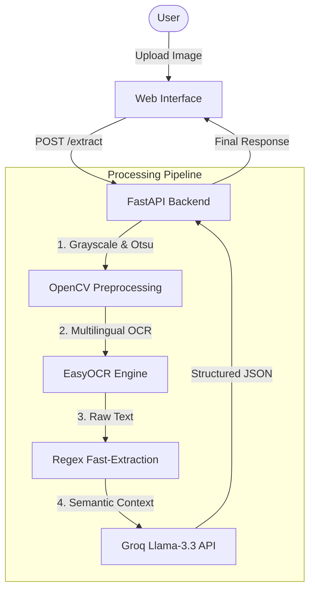

# 📄 Bangla-English Document AI Pipeline

[](https://huggingface.co/spaces/mrshibly/LlamaOCR-Pipeline)
[](https://www.python.org/downloads/release/python-3100/)
[](https://fastapi.tiangolo.com/)

A professional-grade Document AI pipeline that extracts structured information (Names, NID, DOB, Address) from scanned Bangla and English documents using **EasyOCR** and **Llama 3 (via Groq)**.

## 🎬 Live Demo

**🚀 Try it now:** [https://huggingface.co/spaces/mrshibly/LlamaOCR-Pipeline](https://huggingface.co/spaces/mrshibly/LlamaOCR-Pipeline)

### Demo Video


---

## 🚀 Overview

This project provides an end-to-end solution for digitizing identification documents. It combines traditional computer vision (OpenCV), state-of-the-art OCR (EasyOCR), and Large Language Models (LLMs) to transform messy document images into clean, structured JSON data.

### Key Features:
- **Hybrid OCR**: High-accuracy recognition for both Bangla and English scripts using EasyOCR.
- **LLM-Powered Extraction**: Uses Llama 3.3 70B (Groq) to understand document semantics and extract names/addresses.
- **Interactive UI**: A sleek, glassmorphism-inspired web interface built with Tailwind CSS.
- **Dockerized**: Fully containerized and ready for deployment on Hugging Face Spaces or cloud platforms.
- **Production Ready**: Deployed and running live on Hugging Face Spaces.

---

## 🏗️ Architecture



---

## 🛠️ Tech Stack

- **Backend**: FastAPI, Uvicorn
- **OCR Engine**: EasyOCR (PyTorch)
- **Image Processing**: OpenCV, NumPy
- **LLM Integration**: Groq SDK (Llama 3.3 70B)
- **Frontend**: HTML5, Tailwind CSS, JavaScript
- **Deployment**: Docker, Hugging Face Spaces

---

## 📦 Installation & Setup

### 1. Clone the repository
```bash
git clone https://github.com/mrshibly/LlamaOCR-Pipeline.git
cd LlamaOCR-Pipeline
```

### 2. Install Dependencies
```bash
pip install -r requirements.txt
```

### 3. Set Environment Variables
```bash
# Set your Groq API Key
export GROQ_API_KEY="your_api_key_here"
```

### 4. Run Locally
```bash
python app.py
```
Access the app at `http://localhost:7860`.

---

## 🐳 Docker Deployment

To build and run the container locally:
```bash
docker build -t document-ai .
docker run -p 7860:7860 -e GROQ_API_KEY="your_api_key" document-ai
```

## 🌐 Hugging Face Spaces Deployment

The app is deployed on Hugging Face Spaces using Docker SDK:

1. Create a new Space on Hugging Face
2. Select **Docker** as the SDK
3. Connect your GitHub repository
4. Add `GROQ_API_KEY` as a secret in Space settings
5. The Space will automatically build and deploy

**Live Demo:** [https://huggingface.co/spaces/mrshibly/LlamaOCR-Pipeline](https://huggingface.co/spaces/mrshibly/LlamaOCR-Pipeline)

---

## 📂 Project Structure
```
.
├── app.py                 # Core FastAPI application and logic
├── index.html            # Interactive frontend
├── Dockerfile            # Docker configuration for deployment
├── requirements.txt      # Python dependencies
├── notebooks/            # Research and development exploration
├── samples/              # Example document images for testing
└── README.md             # This file
```

---

## 👨‍💻 Author

**Shibly Ahmed**  
*Software Engineer | AI Enthusiast*

[GitHub](https://github.com/mrshibly) | [Hugging Face](https://huggingface.co/mrshibly)
